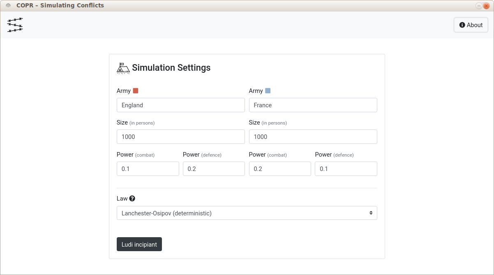
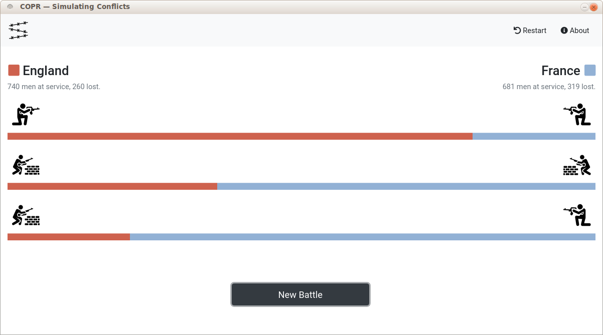
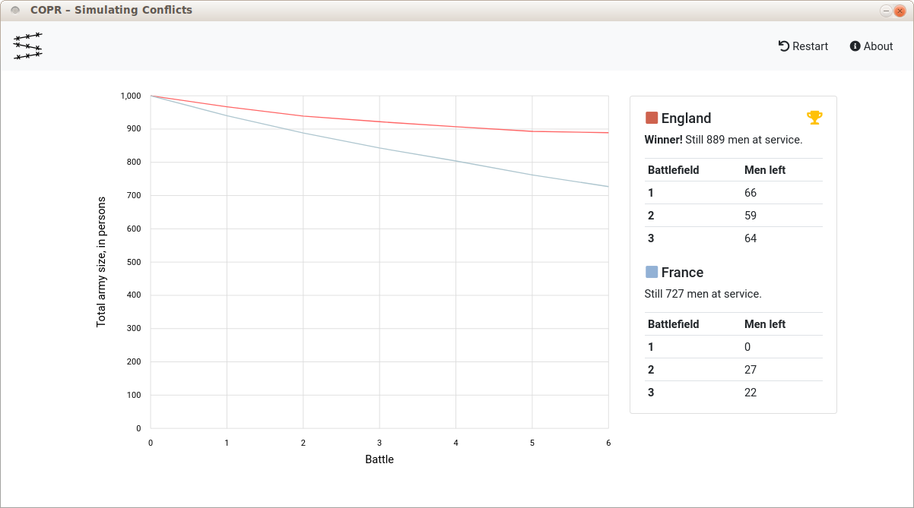

# COPR – Simulating Conflicts

This easy-to-use application enables its users to simulate a military conflict which is mathematically modelled, for example, by [Lanchester’s Square Law](https://en.wikipedia.org/wiki/Lanchester%27s_laws), calculating the relative strengths of both forces.

**COPR** stands for **C**onflict **O**peration **P**lan **R**esponse, an homage to [WOPR](https://www.youtube.com/watch?v=iRsycWRQrc8), the supercomputer in John Badham’s film WarGames, programmed to continuously run war simulations and learn over time.


## Getting started

Install the project’s dependencies

```
$ npm install
```

and start the application with

```
$ npm start
```

> You can also use the [latest release](https://github.com/cosimwue/copr/releases). No installation necessary, just download and click!


## User interface






